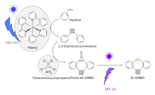

# 4C-DMBO

**Data and analysis code for**  
  
🔗 https://github.com/furthlab/4C-DMBO

---




## 🧪 Summary

This repository contains the complete dataset, analysis scripts, and chemical structure files supporting our manuscript on the synthesis and evaluation of a cyclobutane-fused dibenzocyclooctyne (DMBO) derivative. 

---

## 📁 Repository Structure

```
pyrrolidine-DMBO/
├── R/        # R scripts to reproduce key figures
├── raw_data/
│   ├── NMR/                 # 1H and 13C NMR raw and processed data
│   └── LC-MS/               # LC-MS chromatograms and raw data
│   
├── ChemDraw/              # CDX, MOL, and SMILES files for key compounds
├── figures/                 # Figure source files (PDF/PNG/SVG) used in manuscript
│   ├── illustrator/         # Adobe Illustrator files
│   ├── svg/         # SVG files
│   └── pdf/               # PDFs
└── README.md                # You're reading it!
```
